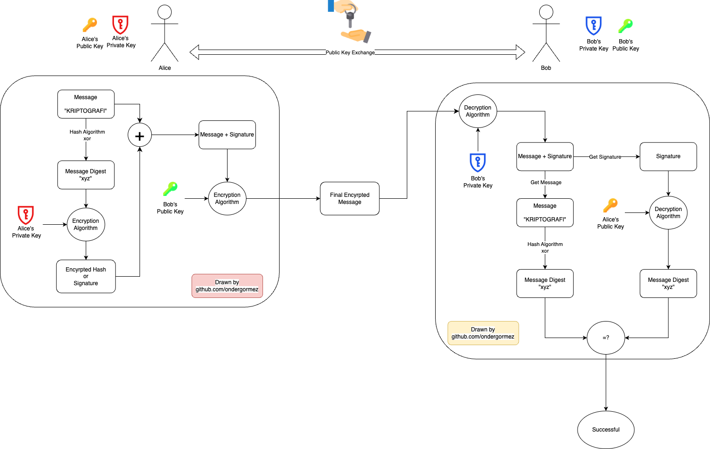

# 13. Week - 13 May 2024 Monday

# Kullanıcı Doğrulama

* Kerberos
* X.509

## Doğrulama

* İleti görünen kaynak yada göndericiden mi geliyor?
* İçerik değiştirilmemiş?
* Zaman ve gönderim sırası değişmemiş?

## İleti Doğrulama Yaklaşımları
* Asymmetric Key Cryptography kullanılarak şifreleme ve imzlama kombinasyonu ile doğrulaması yapılabilir.

## Doğrulama Uygulamaları

* Uygulama için doğrulama yapılabilir.
* Kerberos: Simetrik anahtar doğrulama servisi
* X.509: Asimetrik anahtar dizin doğrulama servisi. Sertifika sistemi de diyebiliriz.

### Kerberos
* 3 başlı köpek mitolojisinden gelir.

Image Source: https://www.linkedin.com/pulse/monstrous-watchdog-distributed-computing-kerberos-anita-nair/

* Kullanıcıların sunuculardaki hizmetlere erişim gereksinimleri var.
* Üç tehdit söz konusu
    * Kullanıcı başka bir kullanıcıymış gibi davranabilir
    * Kullanıcı ağa bağlanan cihazın ağ adresini değiştirebilir.
    * Kullanıcı ağı dinler ve replay attack yapabilir.
* MIT tarafından geliştirilmiş bir yazılımdır.
* Kullanıcı sunucuyu, sunucu da kullanıcıyı doğruluyor.
* Kullanıcıların ağda sunulan hizmetlere erişimine izin verir.
* 4 ve 5 sürümleri var. 4 DES ile çalışır

v4
* Tek bölge sınırlı

v5
* Bölgeler arası doğrulama
* Internet standardı
* RFC1510 ile tanımlanmış bir interne standardı ve pek çok uygulama kullanılıyor.

## Kerberos Sürüm 4 (v4) Genel Bakış
* Authentication Server (AS): Kimlik doğrulama sunucusu içerir.
* Ticket Granting Server (TGS): Kullanıcıya hizmet sunucusuna erişim için bilet verir.
* Ticket Granting Ticket (TGT): İle kulllanıcı TGS'den hizmet sunucusuna erişim için bilet alır.

## Kerberos Sürüm v4 Görüşmesi
AS'den her oturum için 1 kereye mahsus bilet sağlayan bilet alamanız lazım.
* Tehdit: Saldırgan, bilet sağlayan bileti çalar ve süresi dolmadan kullanır.
* Önlem: Süre ne çok kısa olmalı, ne de kötüye kullanıma izin verecek kadar uzun olmalı.

## X.509 Doğrulama Servisi (Sertifikalar)

* S/MIME, IP Security, SSL/TLS ve SET de kulllanılmaktadır.
* RSA kullanımı tavsiye edilmektedir. EC kullanımı da yaygın.

Sertifikanın içerisinde neler var?  

Sertifika Yetklisi (Certification Authority - CA)
* sürüm numarası (1, 2, 3)
* CA tekil seri numarası
* sayısal imza algoritması belirleyici
* düzenleyicinin X.500 ismi (CA)
* Geçerlilik süresi (başlangıç - bitiş)
* taşıyıcı X.500 ismi (sertifika sahibi)
* taşıyıcı anahtar bilgileri (algoritma, parametreler, ...)
* ...

3 versiyonu var, her versiyonda biraz daha genişlemiş durumda.

CA'nın görevi sadece bir anahtarı oluşturmak değil, açık anahtarını doğrulayan bir yapı sağlamak.
* CA dışında hiç kimse, fark edilmeksizin sertifikada yer alan bilgileri değiştiremez.

## Sertifikaların İptali
* Kullanıcının gizli anahtarının ele geçirilmesi
* Sertifika sağlayıcının gizli anahtarının ele geçirilmesi
* Sertifika sağlayıcının, kullanıcıya artık doğrulama sağlamıyor olması (shutdown case)
* Sertifikanın süresinin dolmuş olması

Tek Yönlü Doğrulama  
A->B doğrulaması gerçekleştirilir.

Çift Yönlü Doğrulama  
A->B ve B->A doğrulaması gerçekleştirilir.

Üç Yönlü Doğrulama

## Ödev

Ödev olarak self signed bir sertifika düzenlememiz isteniyor. Böylelikle kendi uygulamalarımızı test ederken kullanabileceğimiz bir pratik elde etmiş oluruz.

* SSL in bir sertifika yaratma (certificate suite) uygulaması var. Bunu kullanarak kendimize bir sertifika yaratmamız isteniyor.
* OpenSSL kullanarak da oluşturabiliriz.
* Özel bir tarih aralığı vs koyabilirsiniz. 3 yıl gibi bir aktiflik süresi.
